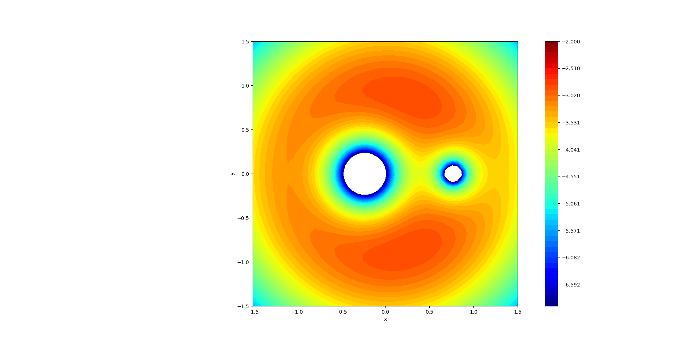

# Modeling_and_Simulations

## Lagrange Points
Model of the Sun-Earth system with a satellite of negligible mass.  

### Structure
All the calculations are done in '<main.c>' which outputs three files. Those are then analyzed using python. First output file are positions of all bodies in inertial reference frame. Second output are also postions but in Co-rotating reference frame. Third output are the pseudo potential values.

Python draws four figures. First and the second are positions in both reference frames. The other two are the 3D-plot of the potential and contour plot. In the contour plot it is possible with small changes to the python code, to calculate the Jacobi constant for initial positions and then draw a zero velocity curve and thus highlighting forbidden regions for the particle. 

### Tasks

- [x] Co-rotating reference frame
- [x] Pseudo Potential
- [ ] Better Data-analysis
- [x] Proper Readme and comments

### Sources: 
* https://gereshes.com
* https://farside.ph.utexas.edu/teaching/336k/Newtonhtml/Newtonhtml.html
* https://nssdc.gsfc.nasa.gov/planetary/planetfact.html 
* https://map.gsfc.nasa.gov/ContentMedia/lagrange.pdf
